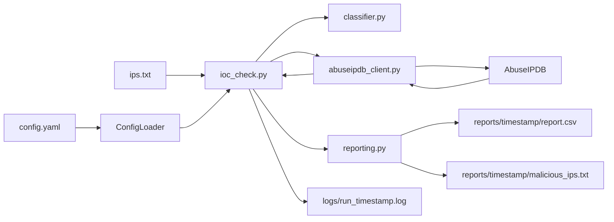

# SOC IOC Hunter


**Turn 4 hours of manual IP lookups into 30 seconds of automated enrichment.**

Stop copy-pasting IPs into AbuseIPDB. This CLI batch-enriches IOC lists, classifies risk instantly, and generates audit-ready CSV reports—so your SOC team focuses on hunting, not typing.

**Not an IDS.** This tool **enriches** indicators — it does not prove compromise or auto-block traffic.

---

## The problem we solve

SOC analysts often check IPs one-by-one in a browser during alert triage. Bulk enrichment is slow, inconsistent, and hard to audit later.

**SOC IOC Hunter** batch-checks AbuseIPDB scores, applies configurable thresholds, skips private addresses, and writes reviewable artifacts for tickets or block recommendations.

**Built for:**

- **MSSPs:** Enrich 100+ client IOCs daily before blocking
- **SOC L1 analysts:** Triage phishing and malware alerts at scale
- **Threat intel teams:** Generate blocklist inputs for firewalls and SIEMs
- **Custom deployments:** Splunk/ELK integration, Slack/Teams alerts, multi-source enrichment

---

## ROI: The math

| Scenario | Manual browser checks | SOC IOC Hunter |
|----------|------------------------|----------------|
| **Single IP** | 2–3 minutes (copy/paste, load page) | **< 2 seconds** |
| **100 IPs** | 4+ hours (plus burnout) | **~3 minutes** (with built-in rate limiting) |
| **Audit trail** | Manual Excel / notepad | **Timestamped CSV + logs** (compliance-ready) |

*Subject to AbuseIPDB plan limits and `request_delay` setting.*

---

## Architecture

```text
ips.txt + config.yaml
        |
        v
   ioc_check.py          # CLI orchestration
        |
        +--> config_loader.py       # YAML load / require()
        +--> classifier.py          # Verdicts + private IP skip
        +--> abuseipdb_client.py    # API + retries
        +--> reporting.py           # reports/<timestamp>/
        +--> logger.py              # console + logs/run_*.log
```



| Module | Role |
|--------|------|
| `ioc_check.py` | CLI entrypoint |
| `config_loader.py` | Config load; friendly error if missing |
| `abuseipdb_client.py` | HTTP client with retries on 429/5xx |
| `classifier.py` | Score → SAFE / SUSPICIOUS / MALICIOUS; RFC1918 skip |
| `reporting.py` | Timestamped CSV + blocklist |
| `logger.py` | Console + file audit logging |
| `check_api.py` | API key smoke test |
| `config.example.yaml` | Template (copy → local `config.yaml`) |
| `tests/` | Unit tests (classifier, config loader) |

Secrets live only in local **`config.yaml`** (gitignored). Commit **`config.example.yaml`**, never real keys.

---

## Setup

```bash
pip install -r requirements.txt
copy config.example.yaml config.yaml
# Edit config.yaml → set api_key from https://www.abuseipdb.com/account/api
```

## Run

```bash
python check_api.py
python ioc_check.py
python ioc_check.py --config config.yaml --input ips.txt --output-dir ./reports
python -m pytest -q
```

---

## Verdicts

Configurable in `config.yaml` (`thresholds.malicious` / `thresholds.suspicious`):

| Score (default) | Verdict | Meaning |
|----------------:|---------|---------|
| 0–10 | SAFE | Low / no abuse confidence |
| 11–50 | SUSPICIOUS | Worth closer review |
| 51–100 | MALICIOUS | High confidence — candidate for blocklist |

With `skip_private_ips: true` (default), private/RFC1918 addresses are marked `SKIPPED_PRIVATE` and do not consume API calls.

---

## Outputs

Each run creates:

| Artifact | Location |
|----------|----------|
| Investigation CSV | `reports/<YYYY-MM-DD_HHMMSS>/report.csv` |
| High-confidence blocklist | `reports/<YYYY-MM-DD_HHMMSS>/malicious_ips.txt` |
| Run log | `logs/run_<YYYY-MM-DD_HHMMSS>.log` |

CSV columns include Timestamp, IP, Score, Verdict, Country, ISP, TotalReports, UsageType.

---

## Security

- Never commit `config.yaml` with a real API key  
- Rotate any key that appeared in chat, screenshots, or shared archives  
- Treat investigation IPs as sensitive (follow your team’s TLP)  

Full SOP, troubleshooting, and demo script → **[TEAM_GUIDE.md](TEAM_GUIDE.md)**

---

## Need a custom integration for your MSSP?

This repo is the open-source foundation. Production extensions:

- Splunk / Elastic SIEM alert pull
- Slack / Teams enriched notifications
- VirusTotal / MISP as secondary sources
- Scheduled cron deployment

**Email:** mariabatool869@gmail.com  
**LinkedIn:** [linkedin.com/in/mariabatool7](https://linkedin.com/in/mariabatool7)  
**GitHub:** [github.com/mariabatool869-star](https://github.com/mariabatool869-star)
