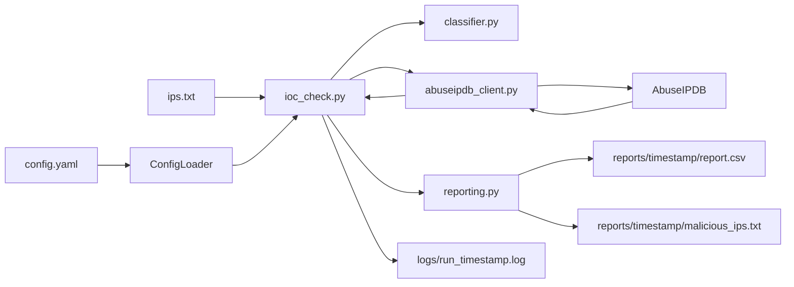

# SOC IOC Hunter

Python CLI for SOC triage: enrich IP IOCs with AbuseIPDB, classify risk, and export timestamped reports plus a high-confidence blocklist.

> **Elevator pitch:** SOC IOC Hunter takes investigation IPs, looks each one up in AbuseIPDB reputation data, and produces a CSV audit report plus a ready-to-use list of high-confidence malicious IPs.

**Not an IDS.** This tool **enriches** indicators — it does not prove compromise or auto-block traffic.

---

## The problem we solve

SOC analysts often check IPs one-by-one in a browser during alert triage. Bulk enrichment is slow, inconsistent, and hard to audit later.

**SOC IOC Hunter** batch-checks AbuseIPDB scores, applies configurable thresholds, skips private addresses, and writes reviewable artifacts for tickets or block recommendations.

**Useful for:**

- SOC L1 triage of phishing / malware / C2-related IPs  
- Threat intel teams enriching IOC lists before recommend-block decisions  
- Labs and portfolios demonstrating production-style threat tooling  

---

## Time savings (illustrative)

| Manual browser checks | With SOC IOC Hunter |
|-----------------------|---------------------|
| Minutes per IP, copy/paste into AbuseIPDB | Roughly seconds per IP (API + local classify) |
| Dozens of IPs can consume a large part of a shift | Dozens of IPs in a few minutes (depends on API quota and `request_delay`) |

Exact speed depends on AbuseIPDB plan limits, network latency, and configured delay between requests.

---

## Architecture

```text
ips.txt + config.yaml
        |
        v
   ioc_check.py          # CLI orchestration
        |
        +--> config_loader.py       # YAML load / require()
        +--> classifier.py          # Verdicts + private IP skip
        +--> abuseipdb_client.py    # API + retries
        +--> reporting.py           # reports/<timestamp>/
        +--> logger.py              # console + logs/run_*.log
```



| Module | Role |
|--------|------|
| `ioc_check.py` | CLI entrypoint |
| `config_loader.py` | Config load; friendly error if missing |
| `abuseipdb_client.py` | HTTP client with retries on 429/5xx |
| `classifier.py` | Score → SAFE / SUSPICIOUS / MALICIOUS; RFC1918 skip |
| `reporting.py` | Timestamped CSV + blocklist |
| `logger.py` | Console + file audit logging |
| `check_api.py` | API key smoke test |
| `config.example.yaml` | Template (copy → local `config.yaml`) |
| `tests/` | Unit tests (classifier, config loader) |

Secrets live only in local **`config.yaml`** (gitignored). Commit **`config.example.yaml`**, never real keys.

---

## Setup

```bash
pip install -r requirements.txt
copy config.example.yaml config.yaml
# Edit config.yaml → set api_key from https://www.abuseipdb.com/account/api
```

## Run

```bash
python check_api.py
python ioc_check.py
python ioc_check.py --config config.yaml --input ips.txt --output-dir ./reports
python -m pytest -q
```

---

## Verdicts

Configurable in `config.yaml` (`thresholds.malicious` / `thresholds.suspicious`):

| Score (default) | Verdict | Meaning |
|----------------:|---------|---------|
| 0–10 | SAFE | Low / no abuse confidence |
| 11–50 | SUSPICIOUS | Worth closer review |
| 51–100 | MALICIOUS | High confidence — candidate for blocklist |

With `skip_private_ips: true` (default), private/RFC1918 addresses are marked `SKIPPED_PRIVATE` and do not consume API calls.

---

## Outputs

Each run creates:

| Artifact | Location |
|----------|----------|
| Investigation CSV | `reports/<YYYY-MM-DD_HHMMSS>/report.csv` |
| High-confidence blocklist | `reports/<YYYY-MM-DD_HHMMSS>/malicious_ips.txt` |
| Run log | `logs/run_<YYYY-MM-DD_HHMMSS>.log` |

CSV columns include Timestamp, IP, Score, Verdict, Country, ISP, TotalReports, UsageType.

---

## Security

- Never commit `config.yaml` with a real API key  
- Rotate any key that appeared in chat, screenshots, or shared archives  
- Treat investigation IPs as sensitive (follow your team’s TLP)  

---

## Interview talking points (1–2 minutes)

1. **Problem:** Analysts need fast enrichment before investigate-or-block decisions.  
2. **Approach:** Batch AbuseIPDB scores; map to SOC verdicts via config thresholds.  
3. **Design:** Secrets in YAML; modular client / classifier / reporting; retries + request delay; private-IP skip; timestamped reports and logs.  
4. **Outputs:** Audit CSV + malicious action list.  
5. **Limit:** Reputation is one signal — CDNs, Tor exits, and shared hosting still need human judgment.  

Full SOP, troubleshooting, and demo script → **[TEAM_GUIDE.md](TEAM_GUIDE.md)**

---

## Custom work / contact

Need Splunk export, Slack alerts, or multi-source enrichment for a lab or MSSP workflow? Open an issue on this repo or reach out via [LinkedIn](https://www.linkedin.com/) (replace with your profile URL).
