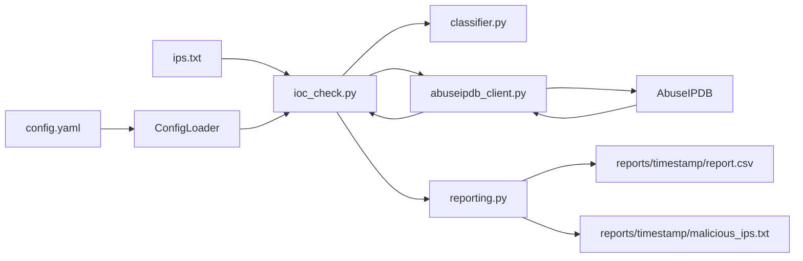

# SOC IOC Hunter

## What you have today (30-second truth)

A Python CLI that reads IPs from `ips.txt`, asks **AbuseIPDB** how abusive each IP looks (score 0–100), labels them **SAFE / SUSPICIOUS / MALICIOUS** using thresholds in `config.yaml`, skips private RFC1918 addresses, and writes timestamped outputs under `reports/<run>/` (`report.csv` + `malicious_ips.txt`).



## Core pieces

| File | Role |
|------|------|
| `ioc_check.py` | CLI entrypoint — load config, load IPs, classify, call API, write reports |
| `config_loader.py` | Loads YAML; friendly error if `config.yaml` is missing |
| `abuseipdb_client.py` | AbuseIPDB HTTP client with retries |
| `classifier.py` | Score → verdict; private IP detection |
| `reporting.py` | Timestamped CSV + blocklist writers |
| `logger.py` | Console + file audit logging |
| `check_api.py` | Quick “is my API key alive?” smoke test |
| `config.example.yaml` | Safe template to copy → `config.yaml` |
| `ips.txt` | Input IP list (`#` comments ignored) |
| `tests/` | Unit tests (classifier) |

Secrets live only in local `config.yaml` (gitignored). There is no `main.py` or `config.py`.

## Elevator pitch (15 seconds)

> SOC IOC Hunter takes a list of IP addresses from an investigation, looks each one up in AbuseIPDB reputation data, and produces a timestamped CSV audit report plus a ready-to-use blocklist of high-confidence malicious IPs.

## For a technical interviewer (1–2 minutes)

1. **Problem:** Analysts get many IPs from alerts, logs, and hunts and need fast enrichment before investigate-or-block decisions.
2. **Approach:** Batch AbuseIPDB confidence scores; map them to SAFE / SUSPICIOUS / MALICIOUS via configurable thresholds.
3. **Design:** Secrets in `config.yaml`; modular client/classifier/reporting; retries + request delay; skip private IPs; timestamped report folders; CLI flags.
4. **Outputs:** Full audit trail (`reports/<run>/report.csv`) and action list (`malicious_ips.txt`).
5. **Honest limit:** Reputation is one signal — not proof of compromise; private IPs, CDNs, and Tor exits need human judgment.

## Setup

```bash
pip install -r requirements.txt
copy config.example.yaml config.yaml
# Edit config.yaml → set api_key from https://www.abuseipdb.com/account/api
```

## Run

```bash
python check_api.py
python ioc_check.py
python ioc_check.py --config config.yaml --input ips.txt --output-dir ./reports
python -m pytest -q
```

## Verdicts (`config.yaml` thresholds)

| Score | Verdict | Meaning |
|------:|---------|---------|
| 0–10 | SAFE | Low / no abuse confidence |
| 11–50 | SUSPICIOUS | Worth a closer look |
| 51–100 | MALICIOUS | High confidence — list for block |

With `skip_private_ips: true` (default), addresses like `10.x`, `192.168.x`, `172.16–31.x` are marked `SKIPPED_PRIVATE` and do not call the API.

## Outputs

Each run creates `reports/<YYYY-MM-DD_HHMMSS>/`:

- `report.csv` — Timestamp, IP, Score, Verdict, Country, ISP, TotalReports, UsageType
- `malicious_ips.txt` — IPs at/above the malicious threshold

## Security

- Never commit `config.yaml` with a real key.
- Rotate any key shared in chat, screenshots, or zips.
- Treat investigation IPs as sensitive (TLP as your team requires).

## Team docs

For pitch, demo script, and roadmap → [TEAM_GUIDE.md](TEAM_GUIDE.md).
