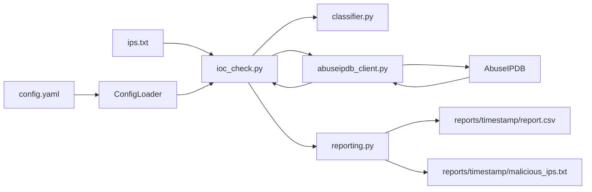

# SOC IOC Hunter — Team Guide

**Explain it + make it better.** Use this for standups, demos, and interviews.

---

## What you have today (30-second truth)

A Python CLI that reads IPs from `ips.txt`, asks **AbuseIPDB** how abusive each IP looks (score 0–100), labels them **SAFE / SUSPICIOUS / MALICIOUS** using thresholds in `config.yaml`, skips private RFC1918 addresses when configured, and writes:

- `reports/<timestamp>/report.csv` — full investigation log  
- `reports/<timestamp>/malicious_ips.txt` — high-confidence blocklist  



**IOC** = Indicator of Compromise — a technical clue (here: an IP) that may indicate malicious activity.

---

## 1. Elevator pitch (15 seconds)

> SOC IOC Hunter takes a list of IP addresses from an investigation, looks each one up in AbuseIPDB reputation data, and produces a timestamped CSV audit report plus a ready-to-use blocklist of high-confidence malicious IPs.

---

## 2. What problem it solves

SOC analysts get many IPs from alerts, firewall logs, or hunts. Checking each by hand is slow. This tool:

1. Batches AbuseIPDB lookups  
2. Maps confidence scores to SAFE / SUSPICIOUS / MALICIOUS  
3. Skips private hosts that AbuseIPDB cannot meaningfully score  
4. Saves an audit CSV and a short action list  

It **enriches** IOCs. It does not prove compromise and does not auto-block traffic.

---

## 3. For a technical interviewer / classmate (1–2 minutes)

Use this script almost as written:

1. **Problem:** Analysts receive many IPs from alerts, logs, and threat hunts, and need fast enrichment before deciding to investigate further or recommend a block.
2. **Approach:** Batch-check AbuseIPDB abuse-confidence scores (0–100) and map them to SOC-friendly verdicts — SAFE, SUSPICIOUS, MALICIOUS — using configurable thresholds in `config.yaml`.
3. **Design choices:**
   - Secrets and settings live in `config.yaml` (not hardcoded in source)
   - Modular layout: config loader, API client, classifier, reporting, thin CLI
   - Retries for flaky / rate-limited API responses, plus a small delay between requests
   - Private/RFC1918 IPs are skipped so we do not waste quota or mislead analysts
   - Each run writes under a timestamped folder so previous investigations are preserved
4. **Outputs:** Full audit trail (`reports/<run>/report.csv`, including country/ISP/report counts) and an action list (`malicious_ips.txt`) for tickets or blocking workflows.
5. **Honest limit:** Reputation is one signal — not proof of compromise. Private IPs, CDNs, shared hosting, and Tor exits still need human judgment.

---

## 4. Core pieces

| File | Role |
|------|------|
| `ioc_check.py` | Real tool — CLI, orchestration, retries/delay wiring |
| `config_loader.py` | Loads YAML; friendly error if config is missing |
| `abuseipdb_client.py` | HTTP client with retries for flaky/429/5xx responses |
| `classifier.py` | Score thresholds + RFC1918 / private IP skip |
| `reporting.py` | Creates `reports/<timestamp>/` and writes CSV + blocklist |
| `logger.py` | Console + file audit logging to `logs/` |
| `check_api.py` | Quick “is my API key alive?” check |
| `config.example.yaml` | Template teammates copy to `config.yaml` |
| `ips.txt` | Input feed (`#` = comment) |
| `tests/test_classifier.py` | Unit tests for verdicts / private IPs |

**Removed / unused (do not bring back):** `main.py`, `config.py`, root-level leftover `report.csv` / `malicious_ips.txt`, old `test_APi.py` — outputs belong only under `reports/`.

### Verdict rules (`config.yaml`)

| Score | Verdict | Meaning |
|------:|---------|---------|
| 0–10 | SAFE | Low / no abuse confidence |
| 11–50 | SUSPICIOUS | Worth a closer look |
| 51–100 | MALICIOUS | High confidence — list for block |

---

## 5. Setup (new teammate)

```bash
pip install -r requirements.txt
copy config.example.yaml config.yaml
```

Set `api_key` from [AbuseIPDB API](https://www.abuseipdb.com/account/api).

```bash
python check_api.py
python ioc_check.py
# or:
python ioc_check.py --config config.yaml --input ips.txt --output-dir ./reports
python -m pytest -q
```

**401 Unauthorized** → invalid/expired key. Fix `api_key` in `config.yaml` and re-run.

---

## 6. Demo script

1. Open `ips.txt` — mix of public + private sample IPs  
2. `python check_api.py` — config loads, key works  
3. `python ioc_check.py` — live checks; private IPs show as skipped  
4. Open newest folder under `reports/` — show CSV + blocklist  
5. Limits: reputation is one signal; CDNs / Tor exits need human judgment  

---

## 7. Quick recap card

| Point | One-liner |
|-------|-----------|
| Problem | Too many IPs to enrich manually during triage |
| Approach | AbuseIPDB scores → SAFE / SUSPICIOUS / MALICIOUS |
| Design | Config-driven, modular, retries, private-IP skip, timestamped reports |
| Outputs | `report.csv` audit trail + `malicious_ips.txt` action list |
| Limit | Reputation ≠ compromise; CDNs / Tor / private IPs need analysts |

---

## 8. Make it better (roadmap)

### Done

- [x] Config via YAML + `ConfigLoader` (no hardcoded key in code)  
- [x] Friendly missing-config error  
- [x] Retries + clear 401 handling  
- [x] Skip private RFC1918 IPs  
- [x] Richer CSV (Country, ISP, TotalReports, UsageType)  
- [x] Timestamped `reports/` folders  
- [x] CLI: `--input`, `--config`, `--output-dir`  
- [x] Request delay between calls  
- [x] Modules split + classifier unit tests  
- [x] `.gitignore`, `config.example.yaml`, README + this guide  

### Next (optional)

- [x] File logging under `logs/`  
- [ ] Mocked HTTP tests for the API client  
- [ ] Second intel source (e.g. VirusTotal) with agree/disagree  
- [ ] Firewall / Suricata export formats  
- [ ] Sample anonymized report artifact for demos  

---

## 9. Security notes

- Never commit `config.yaml` with a real `api_key`.  
- Rotate keys that appeared in chat, screenshots, or shared zips.  
- Treat investigation IPs as sensitive (TLP:AMBER unless told otherwise).  
- Do not publish customer or production IPs in public repos.  

---

## 10. Owner checklist

- [ ] `python check_api.py` succeeds  
- [ ] Sample run creates a folder under `reports/`  
- [ ] `config.yaml` is gitignored and not shared in Slack/email  
- [ ] `python -m pytest -q` passes  
